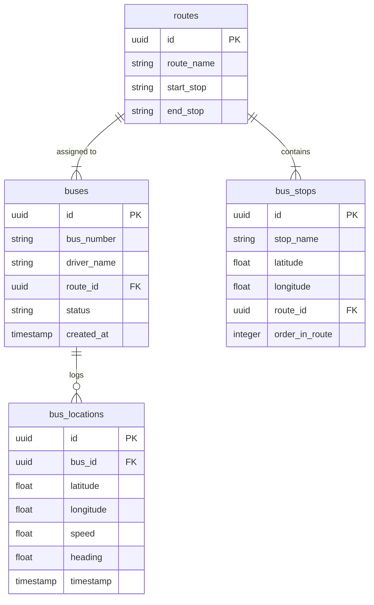

# Database Schema Design

The system uses a PostgreSQL database hosted on Supabase.

## Tables

### 1. `buses`
Stores information about the buses in the fleet.

| Column | Type | Constraints | Description |
|---|---|---|---|
| `id` | UUID | PRIMARY KEY, DEFAULT gen_random_uuid() | Unique identifier for the bus |
| `bus_number` | TEXT | UNIQUE, NOT NULL | Registration number or identifier |
| `driver_name` | TEXT | | Name of the driver |
| `route_id` | UUID | FOREIGN KEY (routes.id) | The route currently assigned to the bus |
| `status` | TEXT | DEFAULT 'active' | Status (active, maintenance, inactive) |
| `created_at` | TIMESTAMPTZ | DEFAULT NOW() | Record creation timestamp |

### 2. `bus_locations`
Stores historical and current location data for buses.

| Column | Type | Constraints | Description |
|---|---|---|---|
| `id` | UUID | PRIMARY KEY, DEFAULT gen_random_uuid() | Unique identifier for the record |
| `bus_id` | UUID | FOREIGN KEY (buses.id) | Reference to the bus |
| `latitude` | FLOAT | NOT NULL | GPS Latitude |
| `longitude` | FLOAT | NOT NULL | GPS Longitude |
| `speed` | FLOAT | | Speed in km/h |
| `heading` | FLOAT | | Direction of travel (0-360) |
| `timestamp` | TIMESTAMPTZ | DEFAULT NOW() | Time of the location update |

### 3. `bus_stops`
Stores the locations of bus stops.

| Column | Type | Constraints | Description |
|---|---|---|---|
| `id` | UUID | PRIMARY KEY, DEFAULT gen_random_uuid() | Unique identifier for the stop |
| `stop_name` | TEXT | NOT NULL | Name of the bus stop |
| `latitude` | FLOAT | NOT NULL | Stop Latitude |
| `longitude` | FLOAT | NOT NULL | Stop Longitude |
| `route_id` | UUID | FOREIGN KEY (routes.id) | Associated route (can be NULL if shared) |
| `order_in_route` | INTEGER | | Sequence number in the route |

### 4. `routes`
Defines the bus routes.

| Column | Type | Constraints | Description |
|---|---|---|---|
| `id` | UUID | PRIMARY KEY, DEFAULT gen_random_uuid() | Unique identifier for the route |
| `route_name` | TEXT | NOT NULL | Name of the route (e.g., "Route 101") |
| `start_stop` | TEXT | | Name of the starting location |
| `end_stop` | TEXT | | Name of the ending location |

## Entity Relationship Diagram (ERD)

## Indexes
- `bus_locations(timestamp)`: For querying history and cleanup.
- `bus_locations(bus_id)`: For filtering by bus.
- `bus_stops(route_id)`: For retrieving stops by route.
